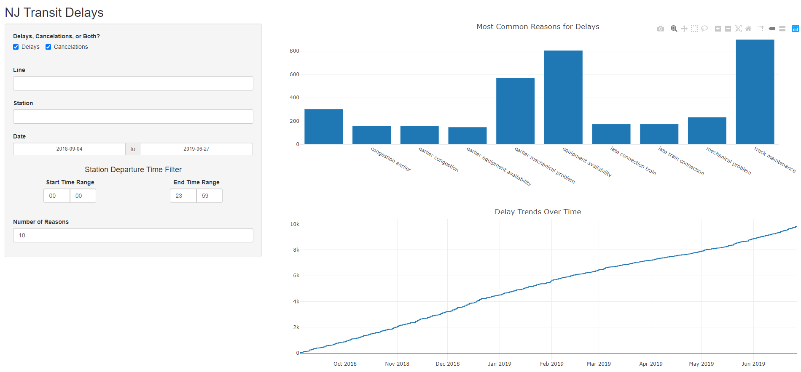

nj_transit
===========
NJ Transit commuter trains are notoriously late. This project contains a dashboard displaying data around train delay dates, times, locations, and reasons. It relies on data scraped from various NJ Transit Twitter accounts.
Dashboard Link: [https://altonji-analytics.shinyapps.io/nj-transit-delays/](https://altonji-analytics.shinyapps.io/nj-transit-delays/)

I have not scraped the Twitter data since mid 2019, so the dashboard is stale.  Anyone interested in updates should reach out to mikealtonji@gmail.com.  

Infrastructure
==============
Twitter Data Collection & Cleaning
-------------------------------------------------
**pull_tweets.py**:  Collects the most recent tweets from the various NJ Transit Twitter accounts. Can only look back at the most recent 3200 per account. While many of these are related to delays, many others contain other information.

**summarize_tweets.py**: Contains many layers of Regex statements, pulling various pieces of information from the Tweets including:
 - Location of delay
 - Reason for delay
 - Date/Time of delay
 - Train Number/Line affected

This section also removes tweets unrelated to delays.

**format_stations.py**: Uses Levenshtein Distance to account for misspelled or abbreviated station names. Example: Pen Station --> Penn Station

R Shiny Dashboard
-------------------------------------------------
While originally planning on using Dash with Python, it was later decided to use R Shiny. R Shiny is more mature, and was much easier to implement the dashboard on. Also of importance, it allowed the dashboard to be hosted on [shinyapps.io](https://altonji-analytics.shinyapps.io/nj-transit-delays/).

The dashboard contains a bar chart of the Top N reasons for delays/cancellations, as well as a line plot showing how the number of delays increases over time. There is also a sidebar panel for selecting inputs, such as date ranges, time-of-day filters, specific stations/routes with cancellations, and more.

Contributors
============
* Michael Altonji

*Interested in collaborating? Email mikealtonji@gmail.com, or submit issues for features you'd like to see in the future!*
